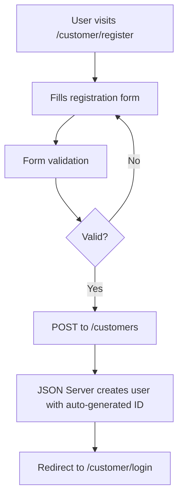
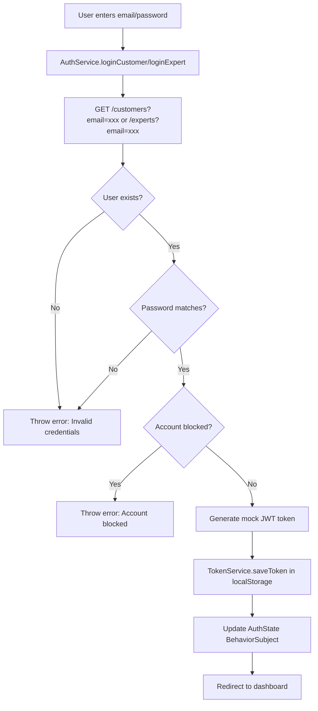
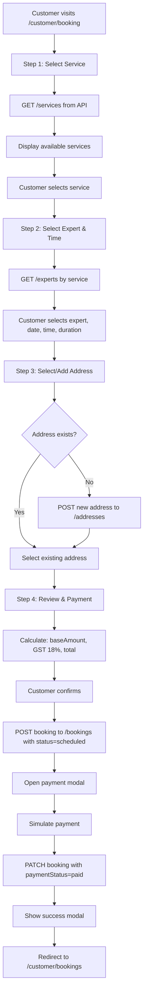
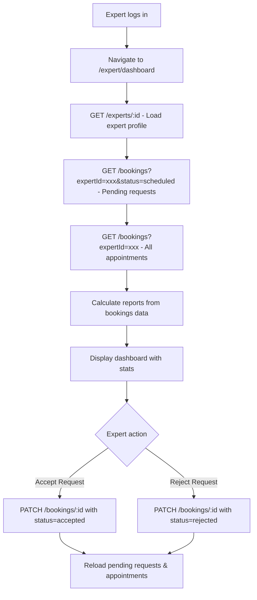
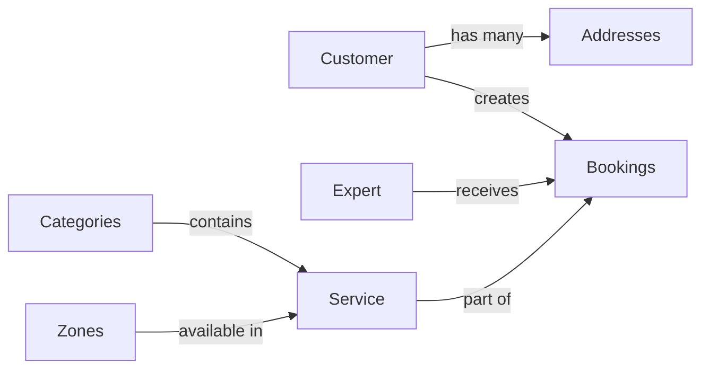

# HouseMate Application - Architecture & Flow Explanation

## 📋 Table of Contents
1. [Project Overview](#project-overview)
2. [Technology Stack](#technology-stack)
3. [Architecture Patterns](#architecture-patterns)
4. [Application Flow](#application-flow)
5. [Key Concepts Used](#key-concepts-used)
6. [Data Flow](#data-flow)
7. [Component Structure](#component-structure)

---

## 🏠 Project Overview

**HouseMate** is a service booking platform built with Angular 19 that connects:
- **Customers** who need household services (cleaning, cooking, gardening, plumbing, etc.)
- **Experts** who provide these services

The application uses a **JSON Server** backend (`db.json`) to simulate a REST API for data persistence.

---

## 🛠️ Technology Stack

### Frontend
- **Angular 19** - Latest version with standalone components
- **TypeScript** - Type-safe JavaScript
- **RxJS** - Reactive programming for async operations
- **Angular Router** - Client-side routing
- **HttpClient** - HTTP communication
- **NgRx** - State management (configured but not fully implemented)

### Backend
- **JSON Server** - Mock REST API using `db.json`
- **Port**: `http://localhost:3000`

### Key Libraries
- `@angular/material` - UI components
- `@angular/animations` - Smooth transitions
- `@ngrx/store`, `@ngrx/effects` - State management
- `rxjs` - Reactive extensions

---

## 🏗️ Architecture Patterns

### 1. **Standalone Component Architecture**
Angular 19 eliminates the need for NgModules. All components are standalone:

```typescript
@Component({
  selector: 'app-booking',
  standalone: true,  // ✅ No NgModule needed
  imports: [CommonModule, RouterModule, FormsModule],
  templateUrl: './booking.component.html'
})
export class BookingComponent { }
```

### 2. **Feature-Based Structure**
```
src/app/
├── core/              # Singleton services (auth, guards, interceptors)
├── features/          # Feature modules
│   ├── customer/      # Customer-related features
│   ├── expert/        # Expert-related features
│   └── landing/       # Public landing page
└── shared/            # Shared components, models, utilities
```

### 3. **Lazy Loading**
Routes use `loadComponent()` for code splitting:

```typescript
{
  path: 'customer/booking',
  loadComponent: () => import('./features/customer/pages/booking/booking.component')
    .then(m => m.BookingComponent),
  canActivate: [customerGuard]  // Protected route
}
```

**Benefits**: 
- Smaller initial bundle size
- Faster load times
- Components loaded only when needed

### 4. **Guard-Based Access Control**
Two types of guards protect routes:

#### **customerGuard**
```typescript
export const customerGuard: CanActivateFn = (route, state) => {
  const authService = inject(AuthService);
  const router = inject(Router);

  if (!authService.isAuthenticated()) {
    router.navigate(['/customer/login'], { queryParams: { returnUrl: state.url } });
    return false;
  }

  if (authService.isCustomer()) return true;
  
  router.navigate(['/']);
  return false;
};
```

**Flow**: User → Route → Guard → Check Auth → Check Role → Allow/Deny

#### **expertGuard**
Similar logic but checks for `ROLE_EXPERT` instead.

---

## 🔄 Application Flow

### **1. User Registration Flow**



**Concepts Used**:
- **Reactive Forms** or **Template-driven Forms** for validation
- **HttpClient** for POST requests
- **Router** for navigation
- **Data persistence** in `db.json`

---

### **2. Authentication Flow**



**Key Files**:
- [`auth.service.ts`](file:///c:/Users/ayush/OneDrive/Desktop/finalassignment/finalassignment/src/app/core/services/auth.service.ts) - Authentication logic
- [`token.service.ts`](file:///c:/Users/ayush/OneDrive/Desktop/finalassignment/finalassignment/src/app/core/services/token.service.ts) - Token storage and validation

**Concepts Used**:
- **BehaviorSubject** - Reactive state management
- **RxJS Operators** - `map`, `catchError`, `tap` for data transformation
- **LocalStorage** - Persistent storage for tokens and user data
- **Mock JWT** - Simulated token generation (production would use backend-generated tokens)

**Token Structure**:
```javascript
const token = `${header}.${payload}.${signature}`;
// Payload contains: userId, roles, iat (issued at), exp (expiry)
```

---

### **3. Booking Flow (Customer)**



**Key Component**: [`booking.component.ts`](file:///c:/Users/ayush/OneDrive/Desktop/finalassignment/finalassignment/src/app/features/customer/pages/booking/booking.component.ts)

**Concepts Used**:

#### **Multi-Step Wizard Pattern**
```typescript
currentStep = 1;
stepsCompleted = {
  service: false,
  expert: false,
  address: false,
  review: false
};

onNext(): void {
  if (this.currentStep < this.totalSteps) {
    this.currentStep++;
  }
}
```

#### **Data Aggregation**
```typescript
bookingData: BookingData = {
  selectedService?: any;
  selectedExpert?: any;
  selectedDate?: string;
  selectedTimeSlot?: string;
  duration?: number;
  selectedAddress?: any;
  baseAmount?: number;
  gst?: number;
  totalAmount?: number;
};
```

#### **Reactive Pricing Calculation**
```typescript
calculatePricing(): void {
  const base = (this.bookingData.selectedExpert?.pricePerHour || 0) * 
                (this.bookingData.duration || 1);
  this.bookingData.baseAmount = base;
  this.bookingData.gst = base * 0.18;  // 18% GST
  this.bookingData.discount = 0;
  this.bookingData.totalAmount = base + this.bookingData.gst - this.bookingData.discount;
}
```

---

### **4. Expert Dashboard Flow**



**Key Component**: [`dashboard.component.ts`](file:///c:/Users/ayush/OneDrive/Desktop/finalassignment/finalassignment/src/app/features/expert/pages/dashboard/dashboard.component.ts)

**Concepts Used**:

#### **Data Filtering**
```typescript
loadPendingRequests(): void {
  this.http.get<any[]>(`${this.apiUrl}/bookings`)
    .subscribe({
      next: (bookings) => {
        // Filter bookings for current expert with "scheduled" status
        this.pendingRequests = bookings.filter(b => 
          b.expertId?.toString() === this.currentExpertId && 
          b.status === 'scheduled'
        );
      }
    });
}
```

#### **Client-Side Aggregation**
```typescript
calculateReports(): void {
  const expertBookings = this.allBookings.filter(
    b => b.expertId?.toString() === this.currentExpertId
  );

  this.totalEarnings = expertBookings
    .filter(b => b.paymentStatus === 'paid')
    .reduce((sum, b) => sum + (b.totalAmount || 0), 0);

  this.completedJobs = expertBookings
    .filter(b => b.status === 'completed').length;

  this.pendingJobs = expertBookings
    .filter(b => b.status === 'scheduled').length;
}
```

---

## 🔑 Key Concepts Used

### **1. Dependency Injection (DI)**
Angular's DI system provides services to components:

```typescript
constructor(
  private authService: AuthService,    // Injected
  private router: Router,               // Injected
  private http: HttpClient              // Injected
) { }
```

**Where**: 
- `authService` defined in [`auth.service.ts`](file:///c:/Users/ayush/OneDrive/Desktop/finalassignment/finalassignment/src/app/core/services/auth.service.ts) with `providedIn: 'root'` (singleton)
- `http` provided by `provideHttpClient()` in [`app.config.ts`](file:///c:/Users/ayush/OneDrive/Desktop/finalassignment/finalassignment/src/app/app.config.ts)
- `router` provided by `provideRouter()` in `app.config.ts`

---

### **2. RxJS & Observables**

#### **BehaviorSubject for State**
```typescript
private authState$ = new BehaviorSubject<AuthState>({
  isAuthenticated: false,
  user: null,
  token: null
});

getAuthState(): Observable<AuthState> {
  return this.authState$.asObservable();
}
```

**Usage**: Components can subscribe to `authState$` to reactively update when authentication changes.

#### **HTTP Streams**
```typescript
this.http.get<Service[]>('/services')
  .pipe(
    map(services => services.filter(s => s.isActive)),  // Transform
    catchError(err => {                                 // Error handling
      console.error(err);
      return of([]);  // Return empty array on error
    })
  )
  .subscribe(activeServices => {
    this.services = activeServices;
  });
```

**Operators Used**:
- `map` - Transform data
- `catchError` - Handle errors gracefully
- `tap` - Side effects (logging)

---

### **3. Guards (Route Protection)**

**Functional Guards (Angular 19 style)**:
```typescript
export const customerGuard: CanActivateFn = (route, state) => {
  const authService = inject(AuthService);  // Inject service
  
  if (!authService.isAuthenticated()) {
    return inject(Router).navigate(['/customer/login']);
  }
  
  return authService.isCustomer();  // Boolean return
};
```

**Applied in Routes**:
```typescript
{
  path: 'customer/dashboard',
  loadComponent: () => import('./dashboard.component'),
  canActivate: [customerGuard]  // Guard applied here
}
```

---

### **4. HTTP Interceptors**

**Auth Interceptor** ([`auth.interceptor.ts`](file:///c:/Users/ayush/OneDrive/Desktop/finalassignment/finalassignment/src/app/core/interceptors/auth.interceptor.ts)):
```typescript
export const authInterceptor: HttpInterceptorFn = (req, next) => {
  const token = inject(TokenService).getToken();
  
  if (token) {
    req = req.clone({
      setHeaders: { Authorization: `Bearer ${token}` }
    });
  }
  
  return next(req);  // Pass modified request
};
```

**Purpose**: Automatically adds `Authorization` header to all HTTP requests.

**Configured in**: [`app.config.ts`](file:///c:/Users/ayush/OneDrive/Desktop/finalassignment/finalassignment/src/app/app.config.ts#L51)
```typescript
provideHttpClient(
  withInterceptors([authInterceptor])
)
```

---

### **5. Component Communication**

#### **Parent-Child (Input/Output)**
```typescript
// Child component
@Input() bookingData!: BookingData;
@Output() stepComplete = new EventEmitter<any>();

onSubmit() {
  this.stepComplete.emit(this.formData);  // Emit to parent
}

// Parent component template
<app-select-service 
  [bookingData]="bookingData"           // Input
  (stepComplete)="onStepComplete('service', $event)"  // Output
></app-select-service>
```

#### **Service-Based (Shared State)**
```typescript
// AuthService maintains state
private authState$ = new BehaviorSubject<AuthState>(...);

// Component A updates state
authService.login(...);

// Component B reads state
authService.getAuthState().subscribe(state => {
  this.isAuthenticated = state.isAuthenticated;
});
```

---

### **6. Template-Driven vs Reactive Forms**

#### **Template-Driven** (simpler, used in some components):
```html
<form #form="ngForm" (ngSubmit)="onSubmit(form)">
  <input name="email" [(ngModel)]="email" required email>
  <button [disabled]="!form.valid">Submit</button>
</form>
```

#### **Reactive Forms** (more control, scalable):
```typescript
loginForm = new FormGroup({
  email: new FormControl('', [Validators.required, Validators.email]),
  password: new FormControl('', [Validators.required, Validators.minLength(6)])
});

onSubmit() {
  if (this.loginForm.valid) {
    const { email, password } = this.loginForm.value;
    this.authService.loginCustomer(email, password);
  }
}
```

---

## 💾 Data Flow

### **Backend Structure (`db.json`)**

```json
{
  "customers": [...],        // User accounts (ROLE_CUSTOMER)
  "experts": [...],          // Expert accounts (ROLE_EXPERT)
  "customerProfiles": [...], // Extended customer info
  "expertProfiles": [...],   // Extended expert info with skills
  "addresses": [...],        // Customer addresses
  "zones": [...],            // Service zones
  "categories": [...],       // Service categories
  "services": [...],         // Available services
  "bookings": [...],         // Booking records
  "reviews": [...]           // Customer reviews
}
```

### **JSON Server REST Endpoints**

| Endpoint | Method | Purpose |
|----------|--------|---------|
| `/customers` | GET | Fetch all customers |
| `/customers?email=xxx` | GET | Find customer by email (login) |
| `/customers` | POST | Register new customer |
| `/experts/:id` | GET | Fetch expert by ID |
| `/services` | GET | Fetch all services |
| `/bookings` | GET | Fetch all bookings |
| `/bookings` | POST | Create new booking |
| `/bookings/:id` | PATCH | Update booking (accept/reject/pay) |
| `/addresses` | POST | Add new address |
| `/addresses?customerId=xxx` | GET | Fetch customer addresses |

### **Data Relationships**



---

## 📦 Component Structure

### **Customer Features**

```
customer/
├── pages/
│   ├── register/           # Customer registration
│   ├── login/              # Customer login
│   ├── dashboard/          # Customer home page
│   ├── booking/            # Multi-step booking wizard
│   │   ├── steps/          # Individual step components
│   │   │   ├── select-service/
│   │   │   ├── select-expert/
│   │   │   ├── select-address/
│   │   │   └── review-payment/
│   │   └── modals/         # Payment modal, success modal
│   ├── my-bookings/        # View booking history
│   ├── profile/            # Edit profile
│   └── settings/           # Account settings
```

### **Expert Features**

```
expert/
├── pages/
│   ├── register/           # Expert registration
│   ├── login/              # Expert login
│   └── dashboard/          # Expert dashboard
│       ├── components/     # Dashboard widgets
│       └── modals/         # Take action modal (accept/reject)
```

### **Shared Components**

```
shared/
├── models/                 # TypeScript interfaces (User, Booking, etc.)
├── components/             # Reusable UI components
└── utils/                  # Helper functions
```

---

## 🔄 State Management

### **Current Approach: Service-Based State**

```typescript
// AuthService acts as a mini state store
class AuthService {
  private authState$ = new BehaviorSubject<AuthState>({...});
  
  getAuthState(): Observable<AuthState> {
    return this.authState$.asObservable();
  }
  
  login(...) {
    // Update state
    this.authState$.next({ isAuthenticated: true, user, token });
  }
}
```

### **NgRx Setup (Configured but Unused)**

Your project has NgRx configured in [`app.config.ts`](file:///c:/Users/ayush/OneDrive/Desktop/finalassignment/finalassignment/src/app/app.config.ts#L58-L76):

```typescript
provideStore({}, {...}),      // Global store
provideEffects([]),           // Side effects
provideRouterStore(),         // Router state
provideStoreDevtools({...})   // Dev tools
```

**If you wanted to use NgRx** (optional for larger apps):
1. Define **Actions** (e.g., `LOGIN`, `LOGOUT`)
2. Create **Reducers** (pure functions to update state)
3. Implement **Effects** (side effects like API calls)
4. **Selectors** (query specific state slices)

**Current architecture is fine** for this app size. NgRx is overkill unless you have:
- Complex state shared across many components
- Advanced caching requirements
- Time-travel debugging needs

---

## 🎯 Summary of Core Concepts

| Concept | Where Used | Purpose |
|---------|------------|---------|
| **Standalone Components** | All components | Eliminate NgModules, simpler architecture |
| **Lazy Loading** | Routes | Code splitting, faster initial load |
| **Guards** | Protected routes | Authorization & authentication |
| **Dependency Injection** | Services in components | Separation of concerns, testability |
| **RxJS Observables** | HTTP, state management | Reactive programming, async handling |
| **Interceptors** | HTTP requests | Add auth headers automatically |
| **BehaviorSubject** | Auth state | Reactive state with initial value |
| **LocalStorage** | Token/user storage | Persist authentication |
| **JSON Server** | Backend | Mock REST API for development |
| **Multi-step Forms** | Booking flow | Complex user input collection |
| **Client-side Filtering** | Expert dashboard | Data aggregation and filtering |

---

## 🚀 Execution Flow Example

**Scenario**: Customer books a service

1. **User visits** `/customer/booking` → Router loads `BookingComponent`
2. **Guard checks** → `customerGuard` verifies authentication
3. **Component initializes** → `ngOnInit()` loads current user
4. **Step 1** → GET `/services` → Display service cards
5. **User selects service** → `onStepComplete('service', data)` → Update `bookingData`
6. **Step 2** → GET `/experts` filtered by service → Display experts
7. **User selects expert, date, time** → `calculatePricing()` → Update totals
8. **Step 3** → GET `/addresses?customerId=xxx` → Display addresses
9. **User adds new address** → POST `/addresses` → Refresh address list
10. **Step 4** → Review booking details → Confirm
11. **Create booking** → POST `/bookings` with `status: 'scheduled'`
12. **Open payment modal** → Simulate payment
13. **Update booking** → PATCH `/bookings/:id` with `paymentStatus: 'paid'`
14. **Show success modal** → Navigate to `/customer/bookings`

---

## 📝 Key Takeaways

1. **Modular Architecture**: Features are isolated (customer/expert)
2. **Reactive Programming**: RxJS handles async operations elegantly
3. **Security**: Guards protect routes, interceptors manage auth headers
4. **Data-Driven**: JSON Server provides realistic backend simulation
5. **Scalability**: Lazy loading and standalone components optimize performance
6. **Type Safety**: TypeScript interfaces ensure data consistency
7. **User Experience**: Multi-step wizards break complex flows into manageable steps

---

## 📚 Further Learning Resources

- **Angular Docs**: https://angular.dev
- **RxJS**: https://rxjs.dev
- **JSON Server**: https://github.com/typicode/json-server
- **NgRx**: https://ngrx.io (if you want to explore state management)

---

**Questions?** Feel free to ask about any specific part of the flow or concept!
